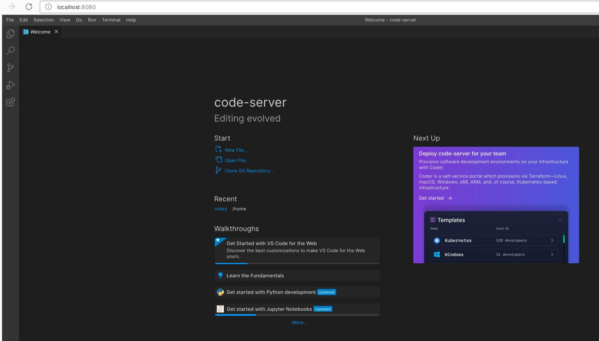

# WEBIDECODE
---

Web IDE Code is a project that aims to render a vscode like web app through **code server**



## [Code-Server](https://github.com/coder/code-server)

Runs VS Code on any machine anywhere and access it in the browser, with the highlights

- Code on any device with a consistent development environment
- Use cloud servers to speed up tests, compilations, downloads, and more
- Preserve battery life when you're on the go; all intensive tasks run on your server


## Configuration

Every configuration file is stored in the directory /opt/config. Two of them are easily modifiable:

-  **config.yaml** 
```yml
# The name to use in branding. Will be shown in titlebar and welcome message 
app-name: IDE Code
# Text to show on login page
welcome-text: "Welcome to your new VS CODE like IDE."
# Address to bind to in host:port. You can also use $PORT to override the port.
bind-addr: 0.0.0.0:8080
# Path to a socket (bind-addr will be ignored).
  # socket
# File mode of the socket.
  # socket-mode
# The type of authentication to use. [password, none]
auth: none
# The password for password authentication (can only be passed in via $PASSWORD or the config file)
  # password: a7891bd39f77265282e92690
# The password hashed with argon2 for password authentication (can only be passed in via $HASHED_PASSWORD or the config file).
# Takes precedence over 'password'.
  # hashed-password

# Path to certificate. A self signed certificate is generated if none is provided.
cert: false
# Hostname to use when generating a self signed certificate.
  # cert-host:
# Path to certificate key when using non-generated cert.
  # cert-key
# Disable telemetry
```
Contains the application settings among which :
   - authentication (password, none)
   - host:port binding
   - github authentication token or $GITHUB_TOKEN env var
   - certificate
   - user directory
   - extension directory

By default, the application is called **IDE Code**, has a welcome-text, no authentication and runs on 0.0.0.0:8080

VSCode is also known to be a self configured environment through the extensions: 

- **extensions.txt** 

This file contains a list of VS Code extension to be installed at creation. by default there are:
```txt
# Install or update a VS Code extension by id or vsix. The identifier of an extension is `${publisher}.${name}`.
#  To install a specific version provide `@${version}`. For example: 'vscode.csharp@1.2.3'.
# Extension MarketPlace: https://marketplace.visualstudio.com/VSCode 

ms-python.python
ms-toolsai.jupyter
formulahendry.code-runner
``` 

## RUN WEBIDECODE
```bash
docker run -it -p 8080:8080 -v config.yaml:/opt/config/config.yaml -v extensions.txt:/opt/config/extensions.txt --name codeide robertoNdams/webidecode
```


